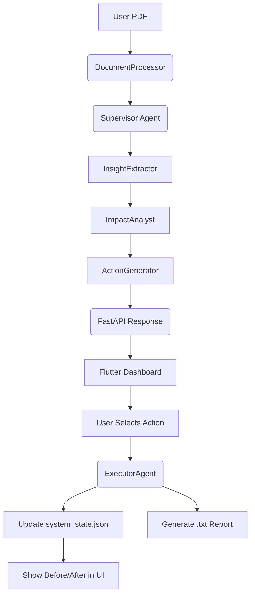

# Insights AI: System Workflow & Logic

This document explains the internal logic and data flow of the Insights AI Agent, from document ingestion to simulated action execution.

## 1. The Ingestion Pipeline (Content → Structured Text)
When a user uploads a document via the Flutter App, the following occurs:
1. **API Gateway**: FastAPI receives the file via the `/ingest` endpoint.
2. **DocumentProcessorAgent**: 
   - Uses `PyMuPDF` to extract raw text from PDFs.
   - Triggers a "Cleaning" prompt with **Gemini 1.5** to remove header/footer noise, fix character encoding, and preserve financial tables.
3. **Trace Creation**: A new `trace_id` is generated by the `TraceLogger` to begin the audit trail.

## 2. The Reasoning Chain (Text → Actionable Insight)
The `SupervisorAgent` orchestrates a linear reasoning chain with a reflection layer:
- **Step 1: Extraction**: `InsightExtractorAgent` scans the text for "High-Alpha" insights specific to the Pakistani market (e.g., changes in FBR tax laws).
- **Step 2: Analysis**: `ImpactAnalystAgent` takes those insights and calculates the financial/operational risk in PKR, referencing the current `system_state.json`.
- **Step 3: Generation**: `ActionGeneratorAgent` synthesizes the analysis into 3-5 pragmatic, actionable recommendations.
- **Validation**: Before finishing, the Supervisor verifies that the actions are feasible within the local regulatory context.

## 3. Visualization Logic (JSON → UI)
The results are sent to the Flutter app as a structured JSON object.
- **Impact Scoring**: Insights with an `impact_score` > 8 are automatically flagged as "Critical" (Red) in the UI.
- **Trace Mapping**: The reasoning steps are mapped to the **Trace Screen**, allowing the user to click any step and see the raw LLM Input/Output.

## 4. The Action Loop (Simulation → Execution)
This is the most critical part of the autonomous system:
1. **User Selection**: The user clicks "Execute" on a recommended action (e.g., "Automate Tax Filing").
2. **ExecutorAgent Execution**:
   - **Simulation**: The agent reasons about how the action will change the metrics (Revenue, Costs, Compliance).
   - **Digital Twin Update**: The `StateManager` updates `system_state.json` with the new values.
   - **Artifact Generation**: The agent uses a tool to write a physical **Strategic Execution Report** (.txt) to the disk.
3. **Before/After View**: The Flutter app fetches the updated state and shows the side-by-side comparison of organizational health.

## Summary Diagram

